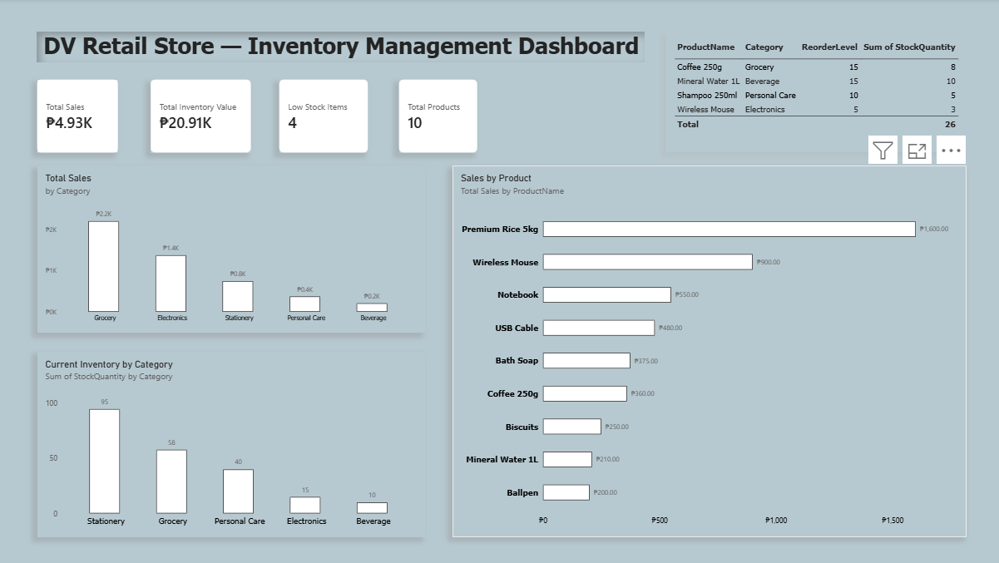

# DV Retail Store – Inventory Management System

A fictional software implementation project created to demonstrate my skills in **requirements gathering, data preparation, SQL database configuration, Power BI reporting, user acceptance testing (UAT), documentation, client training, and go-live preparation.**

> **Portfolio Simulation:** DV Retail Store is a fictional client created for demonstration purposes. All data used in this project is sample data.

---
## Dashboard Preview



## Project Overview

**Project Type:** Software Implementation Simulation  
**Role:** Implementation Specialist / Data Analyst  
**Client:** DV Retail Store (Fictional)  


### Objective

The objective of this project was to design and implement a simple inventory management and reporting solution to replace manual inventory tracking.

The solution allows users to:

- Maintain product information
- Track current inventory levels
- Monitor low-stock products
- Record and analyze sales transactions
- Calculate inventory value
- View key business metrics through a Power BI dashboard

---

## Implementation Lifecycle

**Requirements → Data Preparation → Database → Reporting → Testing → Training → Go-Live**

---

## Tools & Technologies

- **Microsoft Excel** – Data preparation and requirements documentation
- **CSV** – Structured source data
- **SQLite / SQL** – Database creation, data storage, and business queries
- **Power BI Desktop** – Dashboard and reporting
- **Microsoft Word** – User guides and training documentation

---

## Implementation Activities

### 1. Requirements Gathering

Documented business requirements covering:

- Product management
- Inventory tracking
- Low-stock monitoring
- Sales tracking
- Sales reporting
- Inventory valuation
- Management dashboard
- User documentation

### 2. Data Preparation

Prepared sample datasets for:

- Products
- Inventory
- Sales transactions

### 3. Database Configuration

Created a SQLite database containing:

- `Products`
- `Inventory`
- `Sales`

Developed SQL queries for business reporting and inventory monitoring.

### 4. Power BI Reporting

Created an inventory management dashboard containing:

- Total Sales
- Total Inventory Value
- Total Products
- Low Stock Items
- Sales by Category
- Sales by Product
- Current Inventory by Category
- Low-Stock Products

### 5. User Acceptance Testing

Created and executed **12 UAT test cases** covering data accuracy, calculations, dashboard functionality, and usability.

**Result: 12/12 tests passed.**

### 6. Documentation & Training

Prepared:

- User Guide
- Client Training Guide
- Go-Live Checklist
- Implementation Summary
- Troubleshooting guidance

### 7. Go-Live Preparation

Completed a simulated go-live readiness checklist and verified that the solution, documentation, and testing activities were complete.

---

## Key Results

| Metric | Result |
|---|---:|
| Products | 10 |
| Inventory Records | 10 |
| Sales Transactions | 10 |
| Total Recorded Sales | ₱4,925 |
| Estimated Inventory Value | ₱20,905 |
| Low-Stock Products | 4 |
| UAT Test Cases | 12 |
| UAT Passed | 12/12 |
| UAT Failed | 0 |

---

## Project Structure

```text
dv-retail-inventory-implementation/
│
├── 01-Requirements/
│   ├── Project_Overview.pdf
│   └── Business_Requirements.xlsx
│
├── 02-Data/
│   ├── Products.csv
│   ├── Inventory.csv
│   ├── Sales.csv
│   └── Inventory_Source_Data.xlsx
│
├── 03-SQL/
│   ├── 01_Create_Tables.sql
│   ├── 02_Insert_Data.sql
│   ├── 03_Business_Queries.sql
│   └── DV_Inventory.db
│
├── 04-PowerBI/
│   └── DV_Retail_Store_Inventory_Dashboard.pbix
│
├── 05-Testing/
│   └── UAT_Test_Cases.xlsx
│
├── 06-Documentation/
│   ├── DV_Inventory_User_Guide.pdf
│   ├── Client_Training_Guide.pdf
│   ├── Go_Live_Checklist.xlsx
│   └── Implementation_Summary.pdf
│
└── 07-Screenshots/
    ├── 01_Project_Overview.png
    ├── 02_Business_Requirements.png
    ├── 03_SQL_Database.png
    ├── 04_SQL_Low_Stock_Query.png
    ├── 05_PowerBI_Dashboard.png
    ├── 06_UAT_Testing.png
    ├── 07_Go_Live_Checklist.png
    └── 08_Data_Preparation.png
